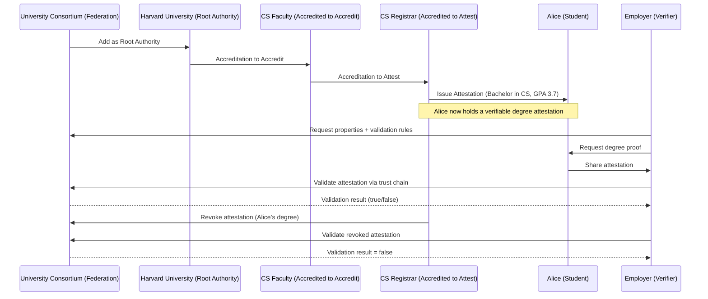

# University Degree Verification with IOTA Hierarchies

In this tutorial, we will build a university degree verification system using IOTA Hierarchies.

We will simulate a consortium of universities that issue and verify digital degrees. Using the IOTA Hierarchies framework, we will:

- Create a federation of universities.
- Define academic properties like degree type and field of study.
- Delegate trust from universities to faculties and registrars.
- Issue digital degrees as attestations.
- Validate degrees against the federation.
- Revoke and reinstate degrees when needed.

By the end, you’ll understand how hierarchical trust, accreditations, and attestations come together to provide a tamper-proof academic verification system.

## Requirements

- Install Rust (v1.70+ recommended).
- Basic knowledge of Rust and the IOTA Identity framework.

## Understanding the Core Concepts Before We Code

Before diving into the code, let’s solidify our understanding of the fundamental building blocks of IOTA Hierarchies. These concepts form the foundation for building decentralized trust systems such as our university degree verification project.

## 1. Federation

Think of a Federation as the umbrella organization that defines the rules of trust for a specific domain — in our case, the University Consortium.

What it is:

- A federation is a decentralized trust framework that groups together multiple trusted parties (e.g., universities) under common governance.
- It sets the properties (like "degree", "field", "GPA") that can be issued, and it anchors root authorities (universities) who are recognized as trusted issuers.

How it works:

- A federation is created on IOTA and published publicly.
- It is the highest-level authority that others can reference for validation.
- Once established, the federation manages who can join and what claims can be issued.

In our project:

- The "University Consortium" is the federation that brings together Harvard, MIT, and other universities.
- This federation defines what counts as a valid academic credential.

## 2. Root Authority

Root Authorities are the trusted institutions at the top level of a federation.

What it is:

- An entity that the federation explicitly trusts to delegate power or issue claims.
- Typically large institutions such as accredited universities, government ministries, or professional licensing boards.

How it works:

- The federation adds an authority as a root authority.
- Once added, that authority can either issue claims directly or delegate responsibility to others.

In our project:

- Harvard and MIT are added as root authorities of the "University Consortium".
- This means both universities are recognized as legitimate sources of academic credentials.

## 3. Accreditation

Accreditation is the process of delegating trust down the hierarchy.

What it is:

- A cryptographic proof that one authority grants certain powers to another.
- Two main types:
    - Accreditation to accredit: grants the right to further delegate authority.
    - Accreditation to attest: grants the right to issue actual claims (attestations).

How it works:

- A university (root authority) can accredit a faculty.
- That faculty can then accredit a registrar.
- Each step is cryptographically recorded so the entire chain can be verified.

In our project:

- Harvard accredits its CS Faculty (to accredit).
- The CS Faculty accredits its Registrar (to attest).

## 4. Attestation

An attestation is the actual claim or credential issued to an individual.

What it is:

- A statement that an authority makes about a subject, bound by the federation’s rules.
- Examples: “Alice holds a Bachelor in Computer Science with GPA 3.7”, “Bob completed a Master in Biology”.

How it works:

- Attestations are cryptographically signed by an accredited authority.
- They are anchored into the federation so anyone can verify them against the root trust chain.

In our project:

- The Harvard CS Registrar issues an attestation to Alice: degree=bachelor, field=cs, gpa=3.7.
- Another attestation is issued to Bob: degree=master, field=cs, gpa=3.9.

## 5. Validation

Validation is the process of checking whether an attestation is trustworthy.

What it is:

- A check that confirms:
    - The attestation exists and hasn’t been revoked.
    - The issuer was properly accredited.
    - The chain of accreditations leads back to a federation root authority.

How it works:

- A verifier (e.g., an employer) queries the federation for the properties and checks the trust chain.
- If everything aligns, the claim is considered valid.

In our project:

- An employer validates Alice’s Bachelor’s degree by confirming the trust chain:
Consortium → Harvard → CS Faculty → Registrar → Attestation for Alice.

## 6. Revocation

Finally, credentials need to be revoked if they become invalid.

What it is:

- The process of invalidating an attestation or accreditation.
- Ensures that outdated or fraudulent credentials are no longer trusted.

How it works:

- A registrar or authority can revoke attestations they’ve issued.
- The federation ensures revocation is discoverable during validation.

In our project:

- If Alice’s degree was mistakenly issued, Harvard’s Registrar can revoke it.
- Validation checks after revocation will fail.

With these core concepts — Federation, Root Authority, Accreditation, Attestation, Validation, and Revocation — we can now clearly understand the trust model behind IOTA Hierarchies.
In the next section, we’ll implement these concepts step by step in Rust.